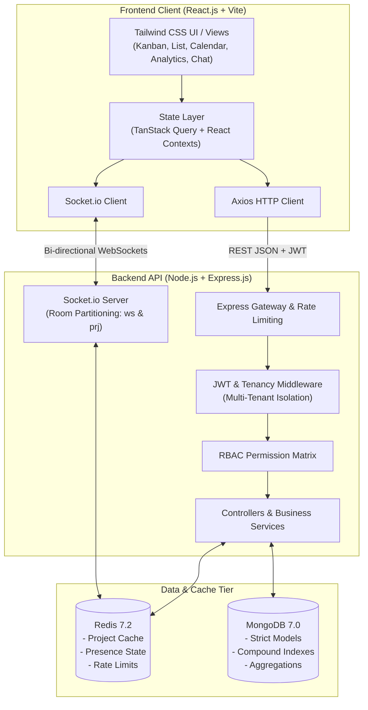
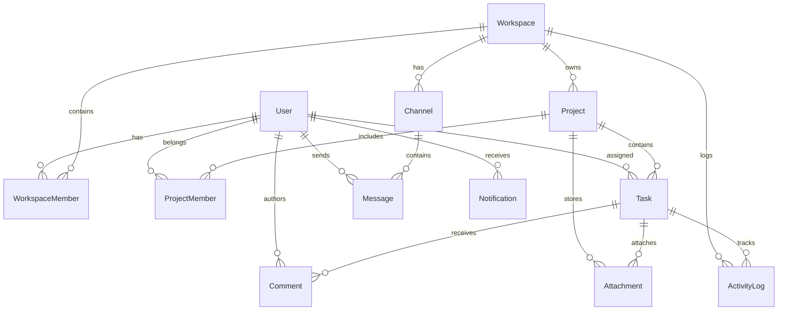
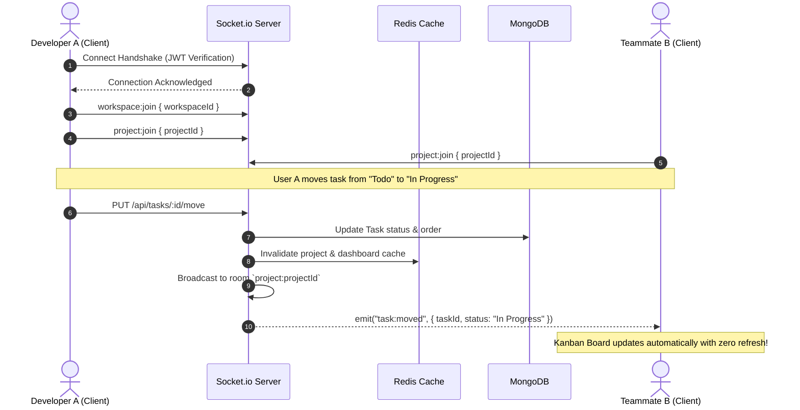

# SyncBoard — Real-Time Collaborative Project Management Platform

[](.github/workflows/ci.yml)
[](https://nodejs.org/)
[](https://react.dev/)
[](https://www.mongodb.com/)
[](https://redis.io/)
[](https://socket.io/)
[](https://tailwindcss.com/)
[](LICENSE)

SyncBoard is a production-quality, full-stack collaborative project management platform built on the **MERN** stack (MongoDB, Express.js, React.js, Node.js) with **JavaScript ONLY**. It combines real-time Kanban boards, team messaging channels, sprint analytics, activity audit trails, and granular workspace role-based access control (RBAC).

Engineered as a portfolio project for software engineering graduates (Class of 2027), showcasing distributed systems design, WebSockets, multi-tenant tenancy isolation, caching patterns, and scalable micro-architecture.

---

## Table of Contents

1. [High-Level Architecture](#high-level-architecture)
2. [Key Features](#key-features)
3. [Tech Stack](#tech-stack)
4. [Database Schema & Models](#database-schema--models)
5. [Real-Time Socket.io System](#real-time-socketio-system)
6. [Redis Architecture & Caching](#redis-architecture--caching)
7. [Role-Based Access Control (RBAC)](#role-based-access-control-rbac)
8. [API Reference](#api-reference)
9. [Quickstart & Local Setup](#quickstart--local-setup)
10. [Seed Data & Demo Credentials](#seed-data--demo-credentials)
11. [Docker Deployment](#docker-deployment)
12. [Testing](#testing)

---

## High-Level Architecture

SyncBoard utilizes a modular client-server architecture with stateful WebSockets for bi-directional live collaboration and Redis for caching and session state.



---

## Key Features

### 1. Interactive Kanban Board & Views
- **5 Column Workflow**: `Backlog`, `Todo`, `In Progress`, `Review`, `Done`.
- **Drag-and-Drop**: Drag tasks across columns and order indexes with optimistic UI updates.
- **Multiple Views**: Switch seamlessly between **Kanban Board**, **Structured Table List**, **Timeline Calendar**, and **Recharts Sprint Analytics**.
- **Task Drawer**: Sub-task checklists with auto-calculated completion progress, markdown descriptions, priority tags (`LOW`, `MEDIUM`, `HIGH`, `URGENT`), date deadlines with overdue badges, attachments, comments, and mentions.

### 2. Real-Time Collaboration (Socket.io)
- **Zero-Refresh Sync**: When User A drags a task or updates a description, User B sees the board mutate instantaneously.
- **Live User Presence**: Online/offline green indicators per workspace backed by Redis sets.
- **Typing Indicators**: Real-time broadcast in channels and direct messages (`chat:typing_start` / `chat:typing_stop`).
- **Instant Alerts**: In-app toast popups when assigned a ticket or mentioned in discussion.

### 3. Team Chat (Channels & Direct Messages)
- **Workspace Public & Private Channels**: `#general`, `#dev-team`, `#releases`, etc.
- **1-on-1 Direct Messages**: Instant conversations between workspace teammates.
- **Message Capabilities**: Edit messages, soft-delete, unread tracking, and `@teammate` mentions.

### 4. Enterprise RBAC & Strict Multi-Tenancy
- **Tenancy Isolation**: Workspace tenants are partitioned using strict middleware (`requireWorkspace`). Users in Workspace A can **never** query or access data belonging to Workspace B.
- **Granular Roles**: `OWNER` (full privileges & transfer), `ADMIN` (team & project management), `MANAGER` (sprint operations), `MEMBER` (contributor), and `VIEWER` (read-only audit).

### 5. MongoDB Aggregation Analytics
- **Live Calculation**: Metrics are computed on-the-fly using MongoDB `$aggregate` pipelines (never hardcoded).
- **Visuals**: Rendered with **Recharts** (velocity area trend, column distribution bar chart, priority donut, and workload by member).

### 6. Search & Audit Trail
- **Spotlight Search**: Global search modal (`Ctrl+K` / `⌘K`) matching tasks, projects, comments, and members.
- **Immutable Activity History**: Append-only log recording actor, entity, and state transitions (`oldValue` -> `newValue`).

---

## Tech Stack

| Layer | Technology | Purpose |
| :--- | :--- | :--- |
| **Frontend** | React 18 (Vite) | Fast component rendering and HMR |
| **Styling** | Tailwind CSS | Modern SaaS design tokens |
| **Client State**| TanStack Query v5 | Server state caching and background refetching |
| **Validation** | Zod | Runtime schema validation |
| **Charts** | Recharts | Responsive sprint velocity charts |
| **Backend** | Node.js + Express.js | Core RESTful API and WebSocket host |
| **Real-Time** | Socket.io v4.8 | Low-latency WebSockets with fallback |
| **Database** | MongoDB 7.0 + Mongoose | Primary document persistence |
| **In-Memory** | Redis 7.2 (ioredis) | Query caching, rate limiting & presence tracking |
| **Security** | bcryptjs, JWT, Helmet | Password hashing and CSRF/XSS protection |
| **Testing** | Jest & Supertest | End-to-end integration and API test suite |
| **DevOps** | Docker & Compose | Multi-container reproducible builds |

---

## Database Schema & Models



### Model Summary
- **User**: Name, email, hashed password, avatar, presence status, verification tokens.
- **Workspace**: Name, slug, description, owner, settings.
- **WorkspaceMember**: Compound index `{ workspace: 1, user: 1 }`, role (`OWNER`, `ADMIN`, `MANAGER`, `MEMBER`, `VIEWER`).
- **Project**: Workspace reference, name, key (`SYNC`), status, priority, taskCounter.
- **Task**: Project, workspace, taskNumber, taskKey (`SYNC-1`), title, description, status (`Backlog`, `Todo`, `In Progress`, `Review`, `Done`), priority, order, assignees, checklist items, attachments, due date.
- **Comment**: Task reference, author, content, mentions array.
- **Channel**: Workspace reference, name, type (`public`, `private`, `direct`), members list.
- **Message**: Channel reference, sender, content, readBy array, mentions, edit flag.
- **ActivityLog**: Immutable audit entry (actor, action, entityType, entityId, diff details).
- **Notification**: User recipient, type, title, message, link, read flag.

---

## Real-Time Socket.io System

SyncBoard uses targeted room partitioning to ensure real-time events only broadcast to authorized users:



### Socket Event Catalog
- `workspace:join` / `workspace:leave`: Partition user into workspace room.
- `project:join` / `project:leave`: Partition user into active project board room.
- `channel:join` / `channel:leave`: Chat channel messaging room.
- `task:created`, `task:updated`, `task:moved`, `task:deleted`: Real-time Kanban board updates.
- `presence:online`, `presence:offline`, `presence:get_online_users`: Presence tracking.
- `chat:typing_start`, `chat:typing_stop`: Live typing indicators.
- `message:sent`, `message:updated`, `message:deleted`: Channel messaging.
- `notification:received`: Direct user push notifications (`user:<userId>` room).

---

## Redis Architecture & Caching

Redis acts as a high-performance in-memory layer providing:
1. **Project & Board Cache**: Project metadata and dashboard aggregates are stored with a 60-second TTL under keys `project:<id>:meta` and `workspace:<id>:dashboard`.
2. **Atomic Cache Invalidation**: Any task creation, status movement, or member modification automatically triggers `CacheService.del()` or pattern invalidation.
3. **Presence Store**: Online members per workspace are managed in Redis Sets (`presence:ws:<workspaceId>`).
4. **API Rate Limiting**: Distributed rate limiting protects login and mutation endpoints via `rate-limit-redis`.
5. **Zero-Setup Fallback**: If Redis server is not running locally, the platform gracefully switches to an in-memory Redis client with zero runtime crashes.

---

## Role-Based Access Control (RBAC)

| Permission | OWNER | ADMIN | MANAGER | MEMBER | VIEWER |
| :--- | :---: | :---: | :---: | :---: | :---: |
| Delete Workspace | ✅ | ❌ | ❌ | ❌ | ❌ |
| Update Workspace Settings | ✅ | ✅ | ❌ | ❌ | ❌ |
| Manage Members & Roles | ✅ | ✅ | ❌ | ❌ | ❌ |
| Invite New Members | ✅ | ✅ | ✅ | ❌ | ❌ |
| Create & Delete Projects | ✅ | ✅ | ✅ | ❌ | ❌ |
| Create, Edit & Move Tasks | ✅ | ✅ | ✅ | ✅ | ❌ |
| Add Comments & Chat | ✅ | ✅ | ✅ | ✅ | ❌ |
| View Boards, Tasks & Analytics | ✅ | ✅ | ✅ | ✅ | ✅ |

---

## API Reference

### Authentication (`/api/auth`)
- `POST /api/auth/register` — Create new account
- `POST /api/auth/login` — Sign in and obtain JWT
- `POST /api/auth/logout` — Clear session cookies
- `GET /api/auth/me` — Get authenticated user details
- `PUT /api/auth/profile` — Update user name, bio, status, avatar
- `POST /api/auth/forgot-password` — Dispatch password reset email
- `POST /api/auth/reset-password` — Set new password using token

### Workspaces (`/api/workspaces`)
- `GET /api/workspaces` — List workspaces current user belongs to
- `POST /api/workspaces` — Create new workspace
- `GET /api/workspaces/:id` — Get workspace metadata
- `PUT /api/workspaces/:id` — Update workspace details (Admin/Owner)
- `DELETE /api/workspaces/:id` — Deactivate workspace (Owner only)
- `GET /api/workspaces/:id/dashboard` — KPI metrics & activity overview
- `GET /api/workspaces/:id/members` — List members and roles
- `PUT /api/workspaces/:id/members/:memberId/role` — Update member role
- `DELETE /api/workspaces/:id/members/:memberId` — Remove member

### Projects (`/api/projects`)
- `GET /api/projects` — List projects in active workspace
- `POST /api/projects` — Create project with custom key
- `GET /api/projects/:id` — Get project details & statistics
- `PUT /api/projects/:id` — Update project metadata
- `DELETE /api/projects/:id` — Archive project

### Tasks & Kanban (`/api/tasks`)
- `GET /api/tasks` — List tasks with filters (`projectId`, `status`, `priority`)
- `POST /api/tasks` — Create task in project (increments task counter)
- `GET /api/tasks/:id` — Fetch task with checklist & comments
- `PUT /api/tasks/:id` — Update task details
- `PUT /api/tasks/:id/move` — Drag-and-drop column & order reordering
- `DELETE /api/tasks/:id` — Delete task
- `POST /api/tasks/:id/checklist` — Add checklist sub-item
- `PUT /api/tasks/:id/checklist/:itemId` — Toggle checklist completion
- `POST /api/tasks/:id/comments` — Add comment with mentions

### Chat & Messaging (`/api/channels`)
- `GET /api/channels` — List workspace channels
- `POST /api/channels` — Create new public or private channel
- `POST /api/channels/direct` — Get or create 1-on-1 direct message
- `GET /api/channels/:id/messages` — Fetch paginated channel messages
- `POST /api/channels/:id/messages` — Send message in channel
- `PUT /api/channels/messages/:msgId` — Edit message
- `DELETE /api/channels/messages/:msgId` — Delete message

### Analytics & Search
- `GET /api/analytics` — Workspace velocity & workload aggregation
- `GET /api/search?q=query` — Global spotlight search

---

## Quickstart & Local Setup

### Prerequisites
- Node.js v20+
- npm v10+
- *(Optional)* Local MongoDB & Redis daemons (The application includes automated in-memory fallbacks so it runs immediately out of the box).

### 1. Clone & Install
```bash
git clone https://github.com/your-username/SyncBoard.git
cd SyncBoard

# Install backend dependencies
cd server && npm install

# Install frontend dependencies
cd ../client && npm install
cd ..
```

### 2. Configure Environment
```bash
cp .env.example server/.env
```

### 3. Seed Database
Populate 10 users, 3 workspaces, 8 projects, 100+ tasks, 50+ comments, and 100+ chat messages:
```bash
npm run seed
```

### 4. Run Development Servers
In two separate terminals:

```bash
# Terminal 1: Run Backend API Server (Port 5000)
npm run dev:server

# Terminal 2: Run Frontend Vite Dev Server (Port 5173)
npm run dev:client
```

Open `http://localhost:5173` in your browser.

---

## Seed Data & Demo Credentials

Use any of the pre-seeded demo accounts to test different permission levels:

| Role | Name | Email | Password | Primary Workspace |
| :--- | :--- | :--- | :--- | :--- |
| **OWNER** | Alex Rivera | `alex@syncboard.dev` | `Password123!` | Acme Corp Engineering |
| **ADMIN** | Samantha Chen | `samantha@syncboard.dev` | `Password123!` | FinTech Cloud Solutions |
| **MANAGER** | David Kim | `david@syncboard.dev` | `Password123!` | Acme Corp Engineering |
| **MEMBER** | Maria Garcia | `maria@syncboard.dev` | `Password123!` | NextGen AI Labs |
| **VIEWER** | Sophia Taylor | `sophia@syncboard.dev` | `Password123!` | Acme Corp Engineering |

> 💡 **Quick Login:** The Login screen features 1-click quick login buttons to switch personas instantly without typing.

---

## Docker Deployment

To spin up the entire multi-tier stack (MongoDB, Redis, Backend, and Nginx-served Frontend):

```bash
docker compose up --build -d
```

- **Frontend Application**: `http://localhost:5173` (or `http://localhost`)
- **Backend API Server**: `http://localhost:5000/api/health`
- **MongoDB**: `localhost:27017`
- **Redis**: `localhost:6379`

To view container logs or stop services:
```bash
docker compose logs -f server
docker compose down
```

---

## Testing

Run the automated integration and RBAC test suite:

```bash
npm test
```

### Test Coverage Highlights:
- ✅ User Registration, duplicate prevention, and Login
- ✅ JWT Authentication & Bearer Header verification
- ✅ Multi-Tenant Isolation (User B blocked from accessing Workspace A)
- ✅ Project CRUD & custom key generation
- ✅ Task creation, Drag-and-Drop column movement, and checklists
- ✅ Task comment discussion threads
- ✅ MongoDB aggregation pipelines & dashboard statistics calculation

---

## License

Distributed under the MIT License. See [LICENSE](LICENSE) for more details.

